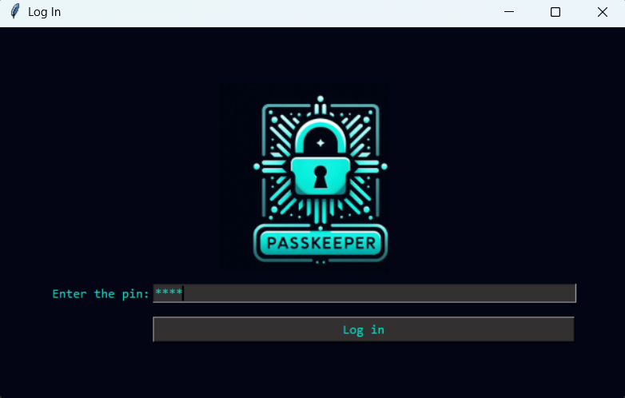
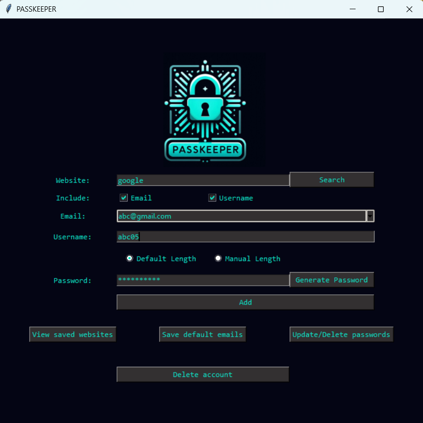

# 🔐 PASSKEEPER - Secure Offline Password Manager

PassKeeper is a lightweight, locally-hosted desktop application built with Python and Tkinter. Designed with privacy and modularity in mind, it provides a secure vault for managing credentials, generating cryptographically strong passwords, and organizing multiple accounts without relying on cloud storage.

## Features

* **Offline First & Privacy Focused:** All data is stored locally in an SQLite database. No cloud sync means zero exposure to web-based breaches.
* **Master PIN Authentication:** Secure gateway to access the application.
* **Dynamic Form UI:** Checkbox-driven interface allows users to save credentials with just an Email, just a Username, or both, adapting the UI on the fly.
* **Multi-Account Support:** Safely store and query multiple accounts (e.g., Personal and Work) under a single website name.
* **Automated Schema Migrations:** Built-in SQLite checks automatically upgrade legacy database tables without data loss when new features are added.
* **Advanced Password Generation:** Uses a combination of device-specific UUIDs and time-based seeds to generate highly randomized, customizable passwords.
* **Quick-Select Emails:** Save frequently used email addresses to a database-backed dropdown for rapid data entry.

## Project Architecture

PassKeeper is engineered using a modular, scalable architecture. By decoupling the database logic, utility functions, and UI views, the codebase adheres to standard software engineering principles (Separation of Concerns).

```text
PassKeeper/
├── assets/                 # Application media and icons
├── views/                  # Modular UI components
│   ├── __init__.py         
│   ├── auth.py             # Login & Registration flows
│   ├── dashboard.py        # Main CRUD interface
│   ├── emails.py           # Default email management
│   ├── update_delete.py    # Targeted multi-account modifiers
│   └── view_all.py         # Formatted data presentation
├── data/                   # Auto-generated isolated database storage
├── config.py               # Centralized constants and dynamic path resolution
├── database.py             # Isolated SQLite logic and schema migrations
├── utils.py                # Pure python helper functions (regex, randomization)
├── main.py                 # Application entry point and view router
├── requirements.txt        # Project dependencies
└── README.md
```

## Getting Started

Follow these steps to get the application running on your local machine.

### Prerequisites
* Python 3.8 or higher
* Git

### Installation

1. **Clone the repository:**
   ```bash
   git clone https://github.com/Atharv-Bandekar/PASSKEEPER.git
   cd PASSKEEPER
   ```

2. **Install dependencies:**
PassKeeper requires the pyperclip library for clipboard operations.
   ```Bash
   pip install -r requirements.txt
   ```

3. **Run the application:**
The application will automatically generate the data/ folder and initialize the SQLite database on its first run.
   ```Bash
   python main.py
   ```


## Screenshots






## Future Development (Roadmap)

* **Password Hashing**: Transition from plaintext storage to bcrypt hashing.

* **Export Functionality**: Allow users to securely export their vault to an encrypted CSV or JSON file.


## Contributing

Contributions, issues, and feature requests are welcome! Feel free to check the issues page.

